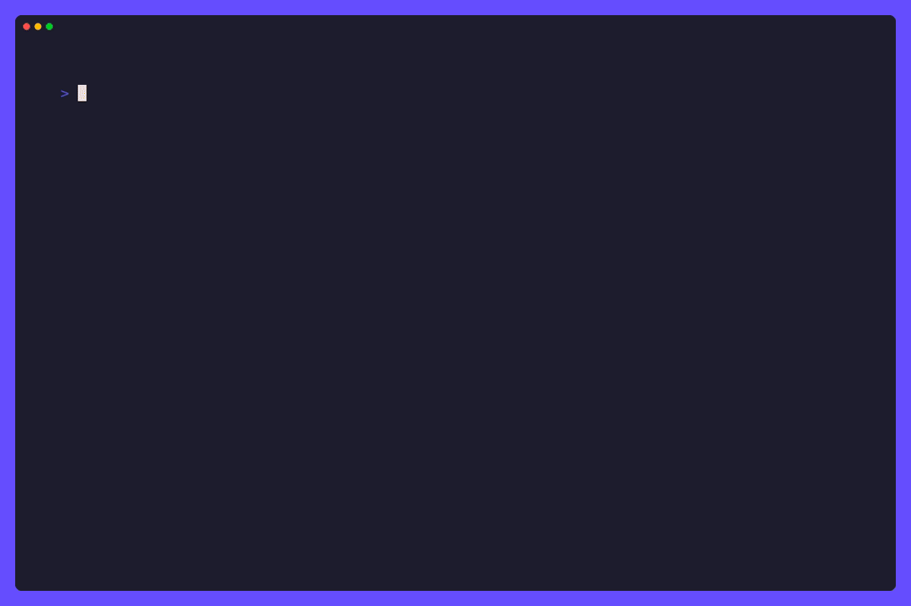

# 📁 Ollamanager: Simplified Model Manager for Ollama 🦙

Ollamanager is a straightforward tool designed to facilitate model downloads,
management, and monitoring for Ollama directly from your terminal.
It offers effortless model selection and tag-based retrieval, accompanied by detailed
progress updates and a user-friendly user interface.



## 🌟 Features

- User-Friendly Interface: With a user-friendly interface and intuitive design,
  Ollamanager offers a seamless experience for users, regardless of their level
  of technical expertise.
- Customization Options: Users have the flexibility to customize the base URL
  for the Ollama server, providing greater control over their environment and
  configuration.
- Cross-Platform Compatibility: Ollamanager is designed to work across
  different platforms, ensuring compatibility and accessibility for users
  regardless of their operating system.

### Install

- Effortless Model Selection: Ollamanager simplifies the process of selecting
  and downloading models for Ollama, streamlining the workflow for users.
  (Models are currently scraped from the [Ollama
  Library](https://ollama.com/library) as there is no official
  API for listing models available for download.)
- Tag-Based Retrieval: Users can easily specify tags to retrieve models,
  allowing for precise selection and customization based on specific
  requirements. Download the exact version of the model you want!
- Detailed Progress Updates: Ollamanager provides detailed progress updates
  during the download process, ensuring users are informed about the status of
  their downloads in real-time.

### Manage

- Effortless Model Management: Ollamanager simplifies the process of managing
  models for Ollama, streamlining the workflow for users.
- Model Updates: Users can easily update models to the latest version, ensuring
  they have access to the latest features and improvements.
- Model Deletion: Users can easily delete models they no longer need, freeing up
  space and reducing clutter.

> [!NOTE]
> Check out [Gollama](https://github.com/Gaurav-Gosain/gollama) for a more
> advanced model management tool that also enables you to chat with your
> models.

### Monitor

- Effortless Model Monitoring: Ollamanager simplifies the process of monitoring
  models for Ollama, providing real-time updates on the status of your models.
- Detailed Model Monitoring: Ollamanager provides detailed monitoring of models,
  allowing you to track currently running models and their status.
- Manage your memory: Ollamanager lets you keep models loaded in memory
  (indefinitely) to avoid unnecessary loading times or to instantly unload
  models when you're done with them.

## 🚀 Getting Started

### Prerequisites

- [Ollama](https://ollama.com/) installed on your system or a ollamanager API server
  accessible from your machine. (Default: `http://localhost:11434`)
  Read more about customizing the base URL [here](#options).
- To find a list of all available models,
  check the [Ollama Library](https://ollama.com/library/).
  You can also use the `ollama list` command to list all locally installed models.

### Installation

You can install Ollamanager using one of the following methods:

#### Download the latest release

Grab the latest release from the
[releases page](https://github.com/Gaurav-Gosain/ollamanager/releases) and extract
the archive to a location of your choice.

#### Install using Go

Make sure you have [Go](https://go.dev/) installed on your system and in path.

You can also install Ollamanager using the `go install` command:

```bash
go install github.com/gaurav-gosain/ollamanager@latest
```

#### Run using Docker

You can pull the latest docker image from the
[GitHub Docker Container Registry](https://github.com/Gaurav-Gosain/ollamanager/pkgs/container/ollamanager)
and run it using the following command:

```bash
docker run --net=host -it --rm ghcr.io/gaurav-gosain/ollamanager:latest
```

You can also run Ollamanager locally using docker:

> [!NOTE]
> The following commands will build the docker image with the tag `ollamanager`.
> You can replace `ollamanager` with any tag of your choice.

1. Clone the repository:

   ```bash
   git clone https://github.com/Gaurav-Gosain/ollamanager.git
   ```

2. Navigate to the project directory:

   ```bash
   cd ollamanager
   ```

3. Build the docker image:

   ```bash
   docker build -t ollamanager .
   ```

4. Run the docker image:

   ```bash
   docker run --net=host -it --rm ollamanager
   ```

#### Build from source

If you prefer to build from source, follow these steps:

1. Clone the repository:

   ```bash
   git clone https://github.com/Gaurav-Gosain/ollamanager.git
   ```

2. Navigate to the project directory:

   ```bash
   cd ollamanager
   ```

3. Build the executable:

   ```bash
   go build
   ```

### Usage

1. Run the executable:

   ```bash
   ollamanager
   ```

   `or`

   ```bash
   /path/to/ollamanager
   ```

2. Follow the on-screen instructions to interact with Ollamanager.

## 📦 Dependencies

Ollamanager relies on the following third-party packages:

- [bubbletea](https://github.com/charmbracelet/bubbletea):
  A library for building terminal applications using the Model-Update-View pattern.
- [bubbles](https://github.com/charmbracelet/bubbles):
  Beautiful TUI components for bubbletea
- [huh](https://github.com/charmbracelet/huh):
  A library for building terminal-based forms and surveys.
- [lipgloss](https://github.com/charmbracelet/lipgloss):
  A library for styling text output in the terminal.

## 🗺️ Roadmap

- [ ] Add CLI flags to directly specify model and tag

## 🤝 Contribution

Contributions are welcome! Whether you want to add new features,
fix bugs, or improve documentation, feel free to open a pull request.

## Star History

[](https://star-history.com/#Gaurav-Gosain/ollamanager&Date)


## 📜 License

This project is licensed under the MIT License -
see the [LICENSE](LICENSE) file for details.
